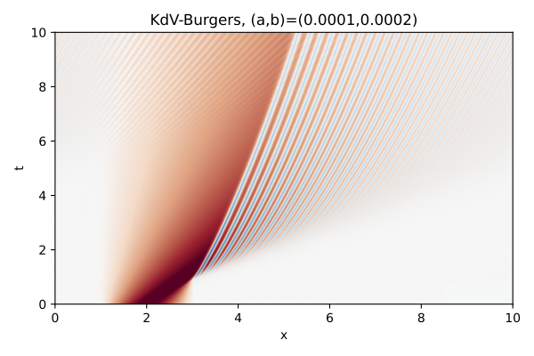
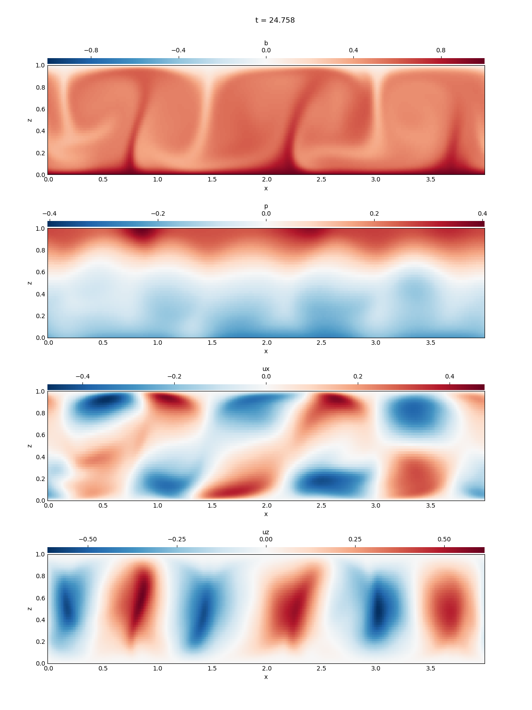
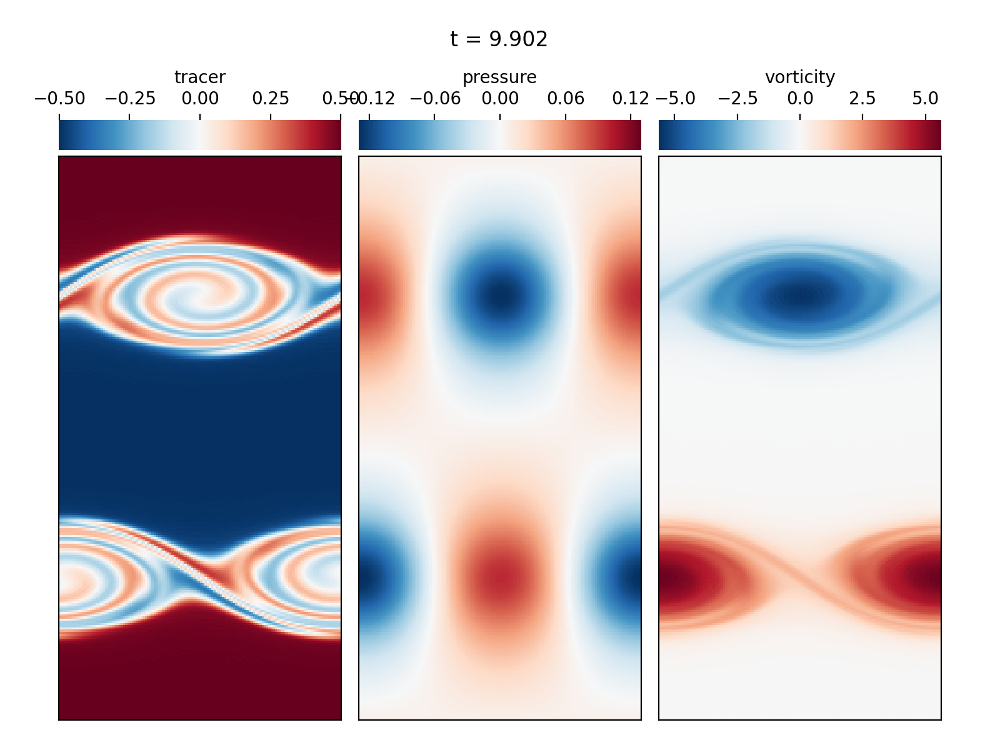
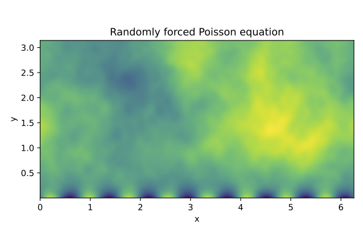
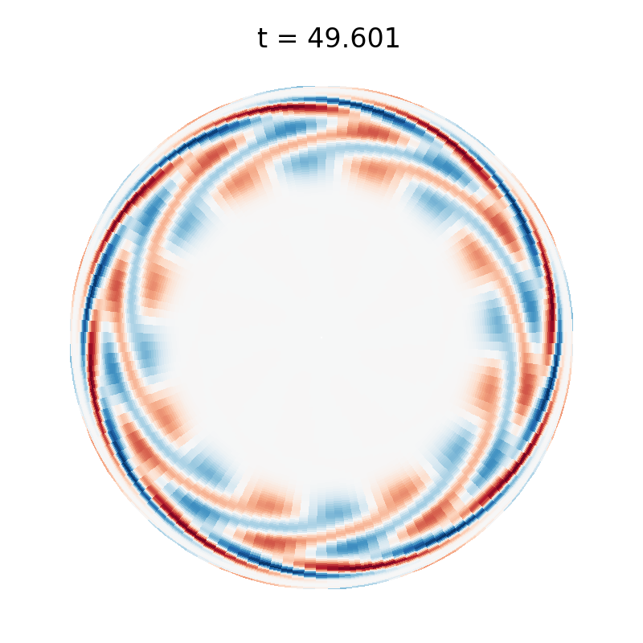
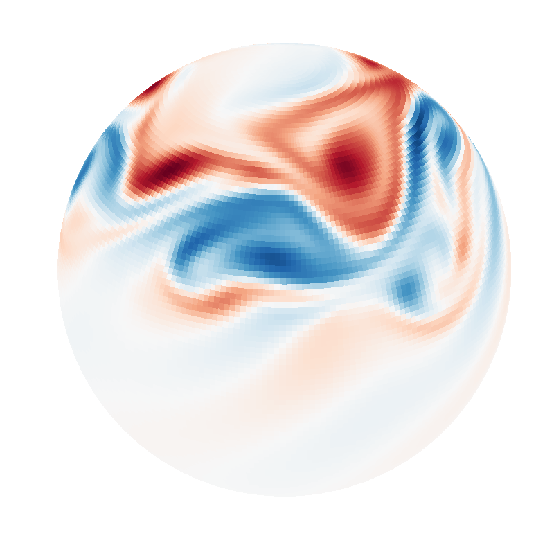
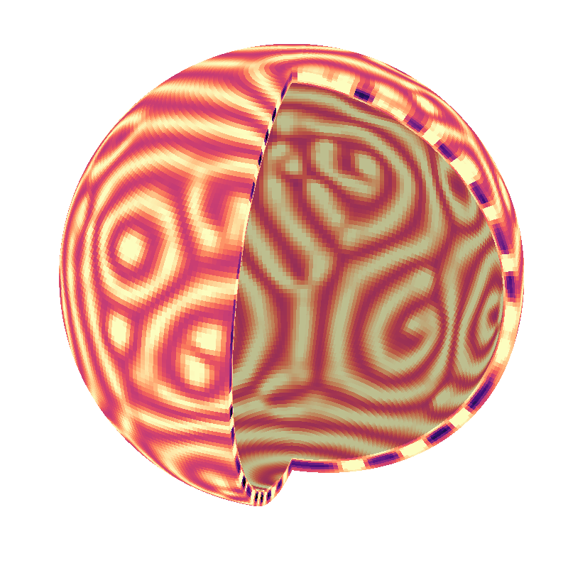
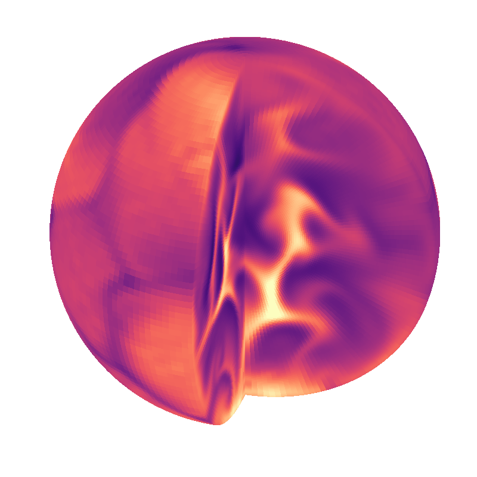

<!-- Title -->
<h1 align="center">
  Dedalus Project
</h1>

<!-- Information badges -->
<p align="center">
  <a href="https://www.repostatus.org/#active">
    
  </a>
  <a href="http://dedalus-project.readthedocs.org">
    
  </a>
  
  
  
</p>

**Note: this branch is the development head of v3 of the codebase, which is currently under beta-release.
The development head of v2 of the codebase is on the ["v2_master" branch](https://github.com/DedalusProject/dedalus/tree/v2_master).**

Dedalus is a flexible framework for solving partial differential equations using modern spectral methods.
The code is open-source and developed by a team of researchers studying astrophysical, geophysical, and biological fluid dynamics.

Dedalus is written primarily in Python and features an easy-to-use interface with symbolic vectorial equation specification.
For example, to simulate incompressible hydrodynamics in a ball, you can symbolically enter the equations, including [gauge constraints](https://dedalus-project.readthedocs.io/en/latest/pages/gauge_constraints.html) and [boundary conditions enforced with the tau method](https://dedalus-project.readthedocs.io/en/latest/pages/tau_method.html), as:

```python
    problem.add_equation("div(u) + tau_p = 0")
    problem.add_equation("dt(u) - nu*lap(u) + grad(p) + lift(tau_u) = - dot(u,grad(u))")
    problem.add_equation("u(r=1) = 0")
    problem.add_equation("integ(p) = 0")
```

Our numerical algorithms produce sparse and spectrally accurate discretizations of PDEs on simple domains, including Cartesian domains of any dimension, disks, annuli, spheres, spherical shells, and balls:

<table style="background-color:#FFFFFF;">
  <tr>
    <th width="25%">
      <a href="https://dedalus-project.readthedocs.io/en/latest/pages/examples/ivp_1d_kdv_burgers.html">
        <figure>
          
          <figcaption>KdV-Burgers equation (1D IVP)</figcaption>
        </figure>
      </a>
    </th>
    <th width="25%">
      <a href="https://dedalus-project.readthedocs.io/en/latest/pages/examples/ivp_2d_rayleigh_benard.html">
        <figure>
          
          <figcaption>Rayleigh-Benard convection (2D IVP)</figcaption>
        </figure>
      </a>
    </th>
    <th width="25%">
      <a href="https://dedalus-project.readthedocs.io/en/latest/pages/examples/ivp_2d_shear_flow.html">
        <figure>
            
            <figcaption>Periodic shear flow (2D IVP)</figcaption>
        </figure>
      </a>
    </th>
    <th width="25%">
      <a href="https://dedalus-project.readthedocs.io/en/latest/pages/examples/lbvp_2d_poisson.html">
        <figure>
            
            <figcaption>Poisson equation (2D LBVP)</figcaption>
        </figure>
      </a>
    </th>
  </tr>
  <tr>
    <th width="25%">
      <a href="https://dedalus-project.readthedocs.io/en/latest/pages/examples/ivp_disk_libration.html">
        <figure>
          
          <figcaption>Librational instability (disk IVP)</figcaption>
        </figure>
      </a>
    </th>
    <th width="25%">
      <a href="https://dedalus-project.readthedocs.io/en/latest/pages/examples/ivp_sphere_shallow_water.html">
        <figure>
          
          <figcaption>Spherical shallow water (sphere IVP)</figcaption>
        </figure>
      </a>
    </th>
    <th width="25%">
      <a href="https://dedalus-project.readthedocs.io/en/latest/pages/examples/ivp_shell_convection.html">
        <figure>
            
            <figcaption>Spherical shell convection (shell IVP)</figcaption>
        </figure>
      </a>
    </th>
    <th width="25%">
      <a href="https://dedalus-project.readthedocs.io/en/latest/pages/examples/ivp_ball_internally_heated_convection.html">
        <figure>
            
            <figcaption>Internally heated convection (ball IVP)</figcaption>
        </figure>
      </a>
    </th>
  </tr>
</table>

The resulting systems are efficiently solved using compiled libraries and are automatically parallelized using MPI.

## Links

* Project homepage: <http://dedalus-project.org>
* Code repository: <https://github.com/DedalusProject/dedalus>
* Documentation: <http://dedalus-project.readthedocs.org>
* Mailing list: <https://groups.google.com/forum/#!forum/dedalus-users>

## Developers

* [Keaton Burns (@kburns)](https://github.com/kburns)
* [Geoff Vasil (@gmvasil)](https://github.com/gmvasil)
* [Jeff Oishi (@jsoishi)](https://github.com/jsoishi)
* [Daniel Lecoanet (@lecoanet)](https://github.com/lecoanet/)
* [Ben Brown (@bpbrown)](https://github.com/bpbrown)
